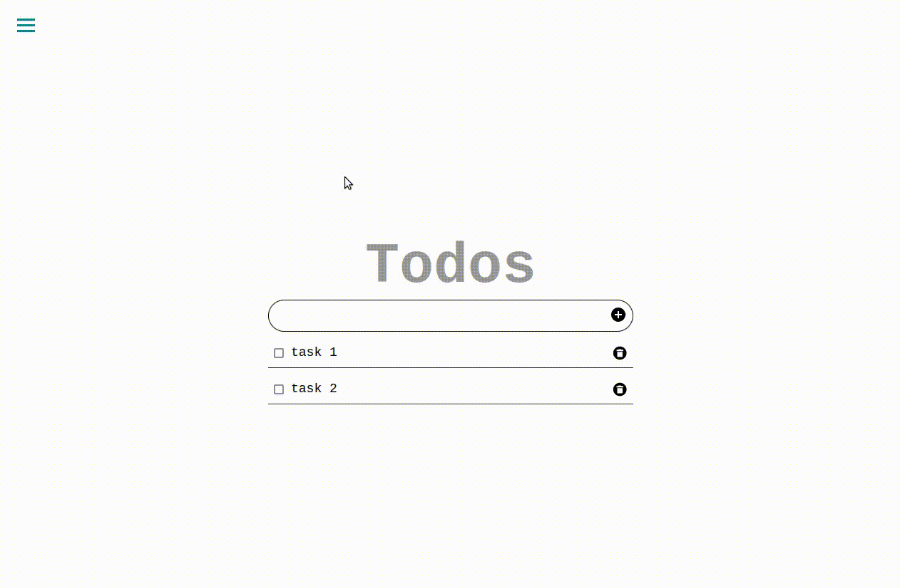

# ReactJS Todo App

this a todo-list app built using react following the [ibaslogic](https://ibaslogic.com/react-tutorial-for-beginners/) Step by Step Guide for beginners.

> functionality included:

- add to by clicking the add button or by pressing enter.
- marking the task as completed by checking the box next to it.
- updating the task description by double-clicking it.
- deleting a task by clicking the trash icon next to it.
- all the data is saved in local storage.
- added a side bar to access the other routes.

## Built With

- HTML
- CSS
- JavaScript
- React

## Getting Started

Clone project, run in your terminal:

`$ git clone https://github.com/rachidelaid/react-todo-tutorial.git`

Open the cloned project in your code editor and run:

`$ cd react-todo-tutorial`

Install npm packages, run:

`$ npm install`

Then run the server:

`$ npm start`

## Authors

👤 **Rachid El aid**

- GitHub: [@rachidelaid](https://github.com/rachidelaid)
- Twitter: [@rachidelaid1](https://twitter.com/rachidelaid1)
- LinkedIn: [rachid elaid](https://www.linkedin.com/in/rachid-elaid-106336203/)

## Show your support

Give a ⭐️ if you like this project!

Feel free to check the [issues page](../../issues/).

## 📝 License

This project is [MIT](./MIT.md) licensed.
